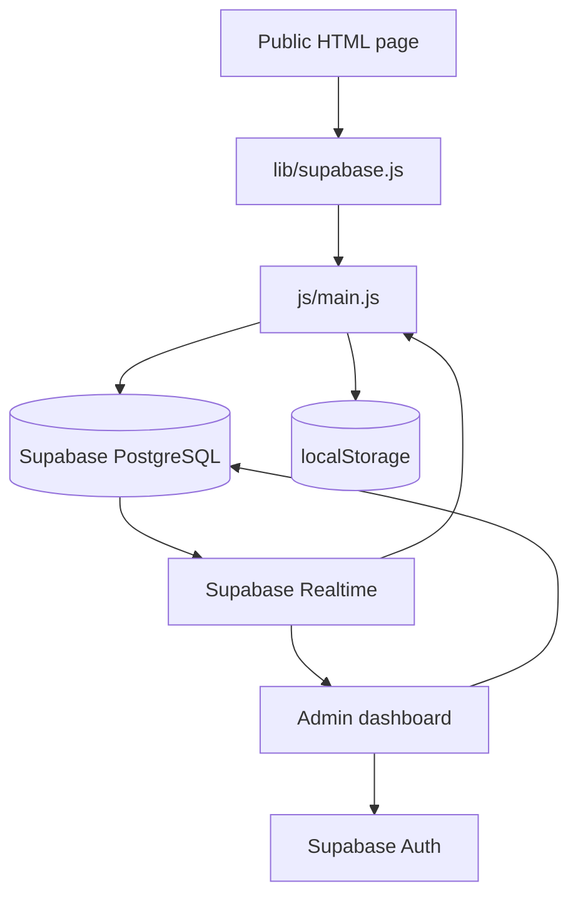

# Veloura

Veloura is a luxury beauty storefront with a browser-based administration dashboard. The public site is a multi-page vanilla JavaScript application. Product, category, banner, blog, review, settings, and media records are stored in Supabase and rendered into HTML at runtime.

> **Project status:** This is a frontend prototype and catalog-management application. Cart, wishlist, newsletter, and checkout interactions are not a complete commerce backend. Review the security notes before deploying it publicly.

## Features

### Storefront

- Responsive luxury beauty catalog for skincare, makeup, hair care, fragrances, tools, gift sets, jewelry, and nails.
- Homepage hero slides, announcement and promotional banners, category discovery, product collections, testimonials, blog preview, newsletter form, and footer settings.
- Shop page with text search, category filters, price filtering, and sorting.
- Product quick-view modal with gallery, pricing, metadata, stock display, and quantity controls.
- Persistent cart and wishlist stored in the browser.
- Light and dark themes with persisted preference.
- Blog listing and article modal for published posts.
- Product, blog, and testimonial carousels with responsive controls and reduced-motion support.
- Supabase Realtime refreshes public content after database changes.

### Admin dashboard

- Supabase Auth sign-in and sign-out.
- Dashboard summary with product, category, blog, review, and stock information.
- CRUD management for products, categories, blog posts, reviews, banners, settings, and media records.
- Featured-product and homepage merchandising controls.
- URL-based media library.
- Realtime refresh after database mutations.

## Technology

| Area | Technology |
| --- | --- |
| Markup | HTML5 |
| Styling | CSS3 with custom properties and responsive media queries |
| Application code | Vanilla JavaScript using browser APIs |
| Build and local server | Vite 5 |
| Database | Supabase PostgreSQL |
| Authentication | Supabase Auth |
| Realtime | Supabase Realtime / Postgres Changes |
| Fonts | Google Fonts: Playfair Display and Jost; local Gallient logo font |
| Client persistence | `localStorage` for cart, wishlist, theme, reviews, and media fallback |
| Hosting | Vercel or another static host |

## Project structure

```text
luxbeauty/
├── index.html                         # Homepage
├── shop.html                          # Searchable product catalog
├── blog.html                          # Published blog posts
├── privacy-policy.html                # Privacy policy
├── terms-of-service.html              # Terms of service
├── package.json                       # Vite scripts and Supabase dependency
├── vite.config.js                     # Multi-page Vite configuration
├── vercel.json                        # Vercel build and routing configuration
├── supabase-schema.sql                # Database tables, policies, seed data
├── css/
│   └── style.css                      # Shared storefront styles
├── js/
│   └── main.js                        # Storefront state and interactions
├── lib/
│   └── supabase.js                    # Browser Supabase client initialization
├── data/                              # Legacy/local JSON content snapshots
│   ├── products.json
│   ├── categories.json
│   ├── banners.json
│   ├── blog.json
│   ├── reviews.json
│   └── settings.json
├── font/
│   └── Gallient.ttf
├── logo/
│   └── logo.png
└── admin-8f7k29x-private-dashboard/
    ├── index.html                     # Admin UI
    ├── admin.css                      # Admin styles
    └── admin.js                       # Admin data and CRUD logic
```

## Requirements

- Node.js 18 or newer.
- npm.
- A Supabase project.
- A Supabase database configured with `supabase-schema.sql`.

## Installation

From the repository root:

```powershell
npm install
```

Start the development server:

```powershell
npm run dev
```

Vite serves the project at `http://localhost:5173` and normally opens a browser automatically. Use the terminal URL if the browser does not open.

Available commands:

```powershell
npm run dev       # Start Vite development server
npm run build     # Build all configured HTML entry points into dist/
npm run preview   # Preview the production build locally
```

For the requested Python static-server workflow, build first and serve the generated files:

```powershell
npm run build
cd dist
python -m http.server 8000
```

Open `http://localhost:8000`. Do not open HTML files directly with `file://`; browser module and asset requests may fail. The Python server serves the already-built bundle, while Vite is required to inject `import.meta.env` values during `npm run build`.

## Supabase setup

1. Create a Supabase project.
2. Open the Supabase SQL Editor.
3. Run [`supabase-schema.sql`](supabase-schema.sql).
4. Create an admin user in Supabase Authentication. The login form expects the user's email address and password.
5. Configure the browser client with the project URL and public anon key.
6. Confirm that the public pages can read the tables and that the admin user can write to them.

Vite exposes variables with the `VITE_` prefix through `import.meta.env`. Create a local `.env` file (already ignored by Git) with these entries:

```dotenv
VITE_SUPABASE_URL=https://your-project.supabase.co
VITE_SUPABASE_ANON_KEY=your-public-anon-key
```

Configure the same variables in Vercel Project Settings under Environment Variables. Never put a Supabase service-role key in browser code. The anon key is designed for client use, but access must still be controlled with RLS policies.

### Current configuration warning

The browser bundle necessarily contains the public anon key at runtime. The protection against unauthorized database access is Supabase Auth plus RLS, not secrecy of the anon key. Keep `.env` and `.env.local` out of Git and never expose a service-role key.

## Database model

The schema creates these tables:

| Table | Purpose | Public access |
| --- | --- | --- |
| `products` | Catalog records, pricing, stock, flags, and metadata | Read |
| `categories` | Category names, banners, subcategories, and ordering | Read |
| `banners` | News banner, promo banner, and hero slide JSON | Read |
| `blog_posts` | Blog article metadata and content | Read |
| `reviews` | Testimonial records | Read |
| `settings` | Singleton site settings JSON document | Read |
| `media_library` | URL-based media records | Read |

The schema enables Row Level Security and grants authenticated users full access. This is intentionally broad for the prototype. A production deployment should replace it with an explicit admin role policy and separate policies for each operation.

### Important field mappings

Supabase uses snake_case columns while the JavaScript UI uses camelCase fields. The main mappings are:

| Database | JavaScript |
| --- | --- |
| `sale_price` | `salePrice` |
| `short_description` | `shortDescription` |
| `skin_type` | `skinType` |
| `best_seller` | `bestSeller` |
| `new_arrival` | `newArrival` |
| `created_at` | `createdAt` |
| `sort_order` | `order` |
| `cover_image` | `coverImage` |
| `publish_date` | `publishDate` |
| `product_name` | `productName` |

`main.js` maps database rows into storefront objects. `admin.js` maps edited objects back into database rows before insert and update operations.

## Application flow



On page load, `main.js` fetches products, categories, banners, blog posts, settings, and reviews in parallel. It then renders only active products and published blog posts. A Supabase Realtime channel reloads the data after a database event.

The browser stores cart and wishlist state locally. This means those records are device-specific and are not associated with an account or server-side order.

## Storefront behavior

### Product visibility

- Product sections include records with `status = 'Active'`.
- Featured, best-seller, and new-arrival sections use their corresponding boolean flags.
- Jewelry and nail sections filter by category name.
- The shop filters and sorts the shared product collection in memory.

### Cart and wishlist

Cart records are stored under `luxbeauty_cart` as `{ id, qty }` objects. Wishlist records are stored under `luxbeauty_wishlist` as product IDs. Stock is displayed but is not currently enforced. Checkout shows a demo state and does not create an order or process payment.

### Theme

The active theme is stored under `luxbeauty-theme` and applied to the `<html>` element as `data-theme="light"` or `data-theme="dark"`. The inline head script initializes the theme early to reduce a flash during page load.

### Content safety

Blog content supports basic heading and bold-text formatting before insertion into the page. Because content is injected into HTML, only trusted administrators should write blog content. Add sanitization before accepting untrusted content.

## Admin workflow

1. Open the admin route: `/admin-8f7k29x-private-dashboard/`.
2. Sign in with a Supabase Auth account.
3. Create or edit catalog and editorial records.
4. Save changes through the dashboard.
5. Confirm the storefront refreshes through Realtime or reload it manually.

The directory name is only an obscure URL. It is not access control. Authentication is provided by Supabase Auth, and database authorization is provided by RLS.

## Deployment

Build the site:

```powershell
npm run build
```

The output is written to `dist/`. The Vite configuration includes these entry points:

- `/index.html`
- `/shop.html`
- `/blog.html`
- `/privacy-policy.html`
- `/terms-of-service.html`
- `/admin-8f7k29x-private-dashboard/index.html`

For Vercel, the repository already includes [`vercel.json`](vercel.json), which runs `npm install`, then `npm run build`, and publishes `dist/`. Add `VITE_SUPABASE_URL` and `VITE_SUPABASE_ANON_KEY` in Vercel Project Settings before deploying. Verify the rewrite behavior for every multi-page route after deployment.

For any static host, deploy the generated `dist/` directory and ensure JavaScript, CSS, fonts, and image URLs are served with the expected relative paths.

## Security and production gaps

This project should not be treated as a complete e-commerce system yet:

- Do not commit private keys or real credentials.
- Replace broad authenticated-user RLS with an explicit administrator role.
- Add server-side order creation, payment processing, inventory checks, shipping, tax, and refunds.
- Add server-side validation and sanitization for all admin content.
- Add rate limiting, audit logging, and account recovery controls.
- Move sensitive operations behind a trusted backend or Supabase Edge Function.
- Add authorization tests for every table and operation.
- Do not rely on `robots.txt` or an obscure admin URL to protect content.
- Treat external Unsplash and Google Fonts requests as third-party dependencies.

## Troubleshooting

### Supabase client errors

Check that `.env` contains `VITE_SUPABASE_URL` and `VITE_SUPABASE_ANON_KEY`, the URL starts with `https://`, and the anon key belongs to the same Supabase project. Restart Vite after changing `.env`, then inspect the browser Console and Network panels.

### Empty storefront

Confirm the tables contain rows, RLS allows public `SELECT`, and the page is being served through Vite rather than opened directly from disk. A failed Supabase request causes the storefront to use an empty catalog and fallback reviews.

### Admin cannot sign in

Confirm the user exists in Supabase Auth, email/password sign-in is enabled, and the browser is using the configured project. The admin form uses the email entered as `signInWithPassword`'s `email` value.

### Changes do not appear

Check the failed mutation in the Console, inspect RLS policies, and verify the Realtime publication includes the changed table. A hard refresh can distinguish a rendering issue from a subscription issue.

### Old cart or review data appears

Clear the relevant browser keys in DevTools:

```js
localStorage.removeItem('luxbeauty_cart');
localStorage.removeItem('luxbeauty_wishlist');
localStorage.removeItem('luxbeauty_reviews');
```

## Roadmap

- Add a secure administrator role and least-privilege RLS policies.
- Add automated tests for data mapping, filters, cart totals, and authentication boundaries.
- Add real checkout, orders, inventory, customer accounts, promotions, and transactional email.
- Add image upload and storage instead of URL-only media records.
- Add metadata management, accessibility audits, performance budgets, and image optimization.
- Remove or clearly label legacy JSON snapshots once the Supabase migration is complete.
